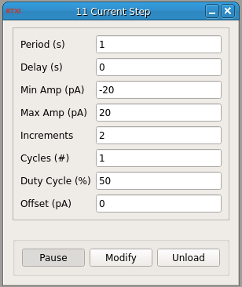

###Current (I) Step

**Requirements:** none  
**Limitations:** none noted  

<!--start-->
This plugin allows you to deliver a series of current step commands.
<!--end-->

####Output Channels
1. output(0) – “Iout” : Step current command in amperes. Connect to the amplifer external signal input.

####Parameters
1. Period (s): period of step input
2. Delay (s): delay between step commands
3. Min Amp (pA): minimum amplitude
4. Max Amp (pA): maximum amplitude
5. Increments: number of steps to take between the minimum and maximum amplitude
6. Cycles (#): number of times to repeat step command
7. Duty Cycle (%): portion of the period during which to apply current of specified amplitude
8. Offset (pA): additional DC current to add
